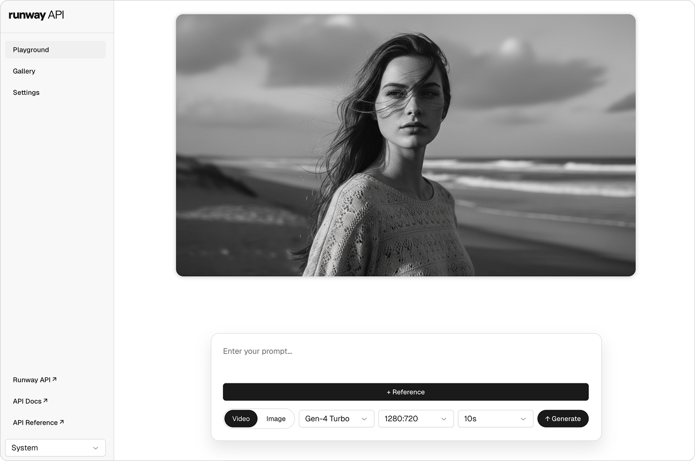

# Runway API Playground




This is a playground for the [Runway API](https://docs.dev.runwayml.com/).

It's a simple web app that allows users to create and edit prompts that will generate images and videos with the different AI models available through the Runway API.

## Tools

- [Runway API](https://runwayml.com/) ([Docs](https://docs.dev.runwayml.com/))
- [Supabase](https://supabase.com/)
- [Next.js](https://nextjs.org/)
- [React](https://react.dev/)
- [TypeScript](https://www.typescriptlang.org/)
- [Radix UI](https://www.radix-ui.com/)
- [Sass](https://sass-lang.com/)
- [Sonner](https://sonner.emilkowal.ski/)

## Local Development

1. Clone the repository
2. Set up Supabase using either [Local Supabase](#local-supabase-docker) (recommended for development) or a hosted project as described in [Supabase Setup](#supabase-setup) and [Supabase Database Setup](#supabase-database-setup)
3. Run `npm install`
4. Run `npm run dev`
5. Open `http://localhost:3000` in your browser
6. Add your Runway API key in the settings page
7. You can now start creating and editing prompts

## Local Supabase (Docker)

You can run Postgres, Auth, Storage, Realtime, and Studio locally with the [Supabase CLI](https://supabase.com/docs/guides/cli/getting-started) and Docker.

1. Install Docker Desktop and the Supabase CLI (`brew install supabase/tap/supabase` on macOS).
2. From the repo root, run `npm run supabase:start` (or `supabase start`). The first run downloads images and applies migrations under `supabase/migrations/`.
3. Copy **Project URL** and **Publishable** (anon) key from the CLI output, or run `npm run supabase:status`.
4. Put them in `.env.local` as `NEXT_PUBLIC_SUPABASE_URL` and `NEXT_PUBLIC_SUPABASE_ANON_KEY` (see `.env.local.example`).

This project uses non-default ports (`55421` API, `55422` database, `55423` Studio, and related ports in `supabase/config.toml`) so it can run alongside another local Supabase stack that uses the default `5432x` ports. If a port is still in use, change the values in `supabase/config.toml` and run `npm run supabase:stop` then `npm run supabase:start` again.

Useful commands: `npm run supabase:stop`, `npm run supabase:reset` (reapply migrations and `supabase/seed.sql`), `npm run supabase:status`.

## Supabase Setup

After creating a new Supabase project (hosted) or [starting local Supabase](#local-supabase-docker), add the following environment variables to your `.env.local` file:

```
NEXT_PUBLIC_SUPABASE_URL=
NEXT_PUBLIC_SUPABASE_ANON_KEY=
```

## Supabase Database Setup

For **local Supabase**, tables, RLS, storage bucket `media`, and Realtime are applied automatically from `supabase/migrations/` when you run `npm run supabase:start` or `npm run supabase:reset`.

For a **hosted** Supabase project, set up the necessary database tables by running the following SQL queries in the SQL Editor.

### Chats Table

```sql
CREATE TABLE public.chats (
  id uuid NOT NULL DEFAULT uuid_generate_v4(),
  user_id uuid NOT NULL REFERENCES auth.users(id) ON DELETE CASCADE,
  created_at timestamptz NOT NULL DEFAULT now(),
  updated_at timestamptz NOT NULL DEFAULT now(),
  PRIMARY KEY (id)
);

ALTER TABLE public.chats ENABLE ROW LEVEL SECURITY;

CREATE POLICY "Users can manage their own chats"
ON public.chats
FOR ALL
USING (auth.uid() = user_id)
WITH CHECK (auth.uid() = user_id);
```

### Prompts Table

```sql
CREATE TABLE public.prompts (
  id uuid NOT NULL DEFAULT uuid_generate_v4(),
  chat_id uuid NOT NULL REFERENCES public.chats(id) ON DELETE CASCADE,
  prompt_text text NOT NULL,
  created_at timestamptz NOT NULL DEFAULT now(),
  updated_at timestamptz NOT NULL DEFAULT now(),
  model text,
  generation_type text,
  ratio text,
  PRIMARY KEY (id)
);

ALTER TABLE public.prompts ENABLE ROW LEVEL SECURITY;

CREATE POLICY "Users can manage prompts in their own chats"
ON public.prompts
FOR ALL
USING (
  EXISTS (
    SELECT 1 FROM public.chats
    WHERE public.chats.id = public.prompts.chat_id
    AND public.chats.user_id = auth.uid()
  )
)
WITH CHECK (
  EXISTS (
    SELECT 1 FROM public.chats
    WHERE public.chats.id = public.prompts.chat_id
    AND public.chats.user_id = auth.uid()
  )
);
```

### Triggers for Timestamps

After creating the tables, set up triggers to automatically update the `updated_at` timestamps:

```sql
-- Create shared trigger function for setting updated_at
CREATE OR REPLACE FUNCTION update_updated_at()
RETURNS TRIGGER AS $$
BEGIN
  NEW.updated_at = now();
  RETURN NEW;
END;
$$ LANGUAGE plpgsql;

-- Trigger for updates on chats
CREATE OR REPLACE TRIGGER update_chats_updated_at
BEFORE UPDATE ON public.chats
FOR EACH ROW EXECUTE FUNCTION update_updated_at();

-- Trigger for updates on prompts
CREATE OR REPLACE TRIGGER update_prompts_updated_at
BEFORE UPDATE ON public.prompts
FOR EACH ROW EXECUTE FUNCTION update_updated_at();

-- Create function to update chat's updated_at on prompt changes
CREATE OR REPLACE FUNCTION update_chat_updated_at()
RETURNS TRIGGER AS $$
BEGIN
  UPDATE public.chats SET updated_at = now() WHERE id = NEW.chat_id;
  RETURN NEW;
END;
$$ LANGUAGE plpgsql;

-- Trigger for inserts on prompts
CREATE OR REPLACE TRIGGER update_chat_on_prompt_insert
AFTER INSERT ON public.prompts
FOR EACH ROW EXECUTE FUNCTION update_chat_updated_at();

-- Trigger for updates on prompts
CREATE OR REPLACE TRIGGER update_chat_on_prompt_update
AFTER UPDATE ON public.prompts
FOR EACH ROW EXECUTE FUNCTION update_chat_updated_at();
```

### Media Table

```sql
CREATE TABLE public.media (
  id uuid NOT NULL DEFAULT uuid_generate_v4(),
  prompt_id uuid NOT NULL REFERENCES public.prompts(id) ON DELETE CASCADE,
  user_id uuid NOT NULL REFERENCES auth.users(id) ON DELETE CASCADE,
  path text NOT NULL,
  type text NOT NULL,
  category text NOT NULL DEFAULT 'output',
  tag text,
  position text,
  created_at timestamptz NOT NULL DEFAULT now(),
  PRIMARY KEY (id)
);

ALTER TABLE public.media ENABLE ROW LEVEL SECURITY;

CREATE POLICY "Users can manage their own media"
ON public.media
FOR ALL
USING (auth.uid() = user_id)
WITH CHECK (auth.uid() = user_id);
```

### Storage Bucket

Create a new storage bucket named "media" in your Supabase project.

Set the bucket to private (not public).

Then, apply the following RLS policy via SQL Editor:

```sql
CREATE POLICY "Users can manage their own media files"
ON storage.objects
FOR ALL
USING (
  bucket_id = 'media'
  AND (auth.uid()::text = (storage.foldername(name))[1])
)
WITH CHECK (
  bucket_id = 'media'
  AND (auth.uid()::text = (storage.foldername(name))[1])
);
```

This policy assumes files are stored in user-specific folders like `{user_id}/filename.ext`.

### Realtime Subscriptions

```sql
-- Enable realtime for tables
ALTER PUBLICATION supabase_realtime ADD TABLE public.chats;
ALTER PUBLICATION supabase_realtime ADD TABLE public.prompts;
ALTER PUBLICATION supabase_realtime ADD TABLE public.media;

-- Enable full replica identity for DELETE events (to receive old records)
ALTER TABLE public.prompts REPLICA IDENTITY FULL;
ALTER TABLE public.media REPLICA IDENTITY FULL;
ALTER TABLE public.chats REPLICA IDENTITY FULL;
```
